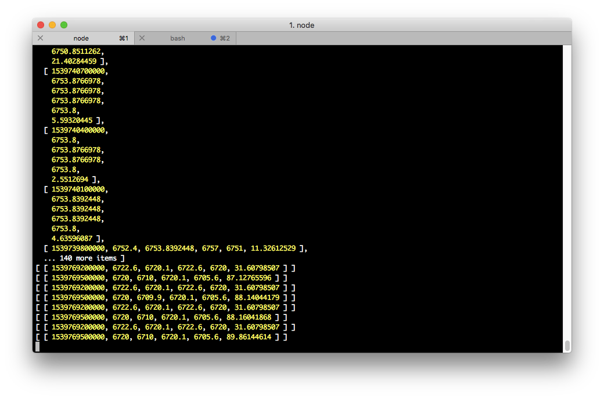
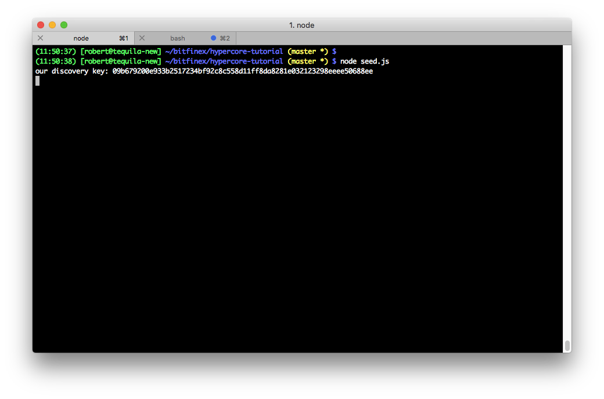
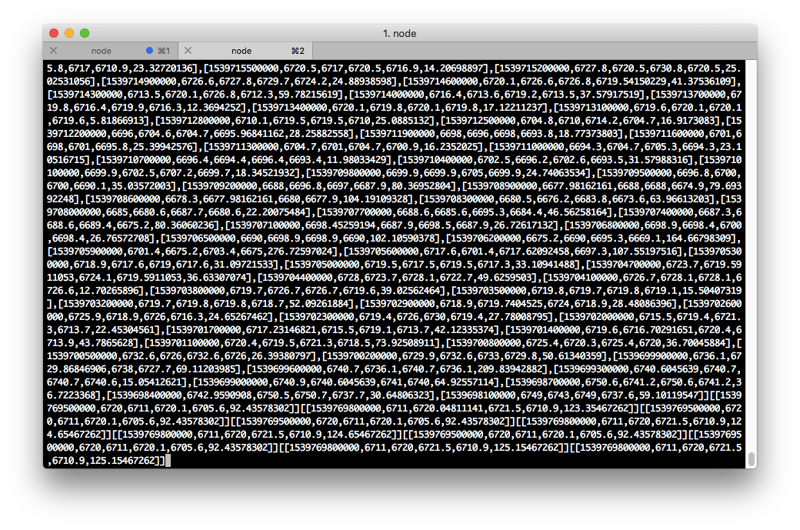
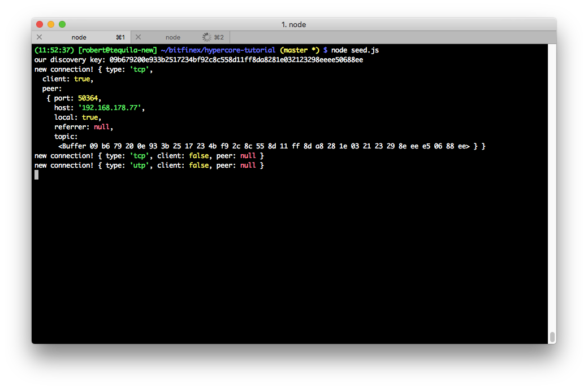

# Sharing Historical Market Data With Hypercore

Today we want to look at a common problem for many traders. Traders often require historical market data to test their strategies. The Bitfinex platform moves more and more into a distributed system. As a sneak peek for the upcoming hypermarket release, we take look how our market data could be shared with a P2P based database.

P2P systems have a lot nice features. Everyone knows BitTorrent. BitTorrent is great, because if more peers are sharing, the faster the network becomes. It is also very hard to shut the BitTorrent network down, if not impossible.

In this tutorial we will use a P2P network which is more tailored to our needs for market data. Because new market data arrives constantly <a href="https://github.com/mafintosh/hypercore">hypercore</a> is a perfect fit. It is a distributed append-only log. hypercore works like BitTorrent, but behaves more like a database. Data is shared as a stream, which makes it perfect for sharing data that is frequently updated. With hypercore, we can also access blocks of data immediately. No need to replicate all the data before we can read data which is stored in the "middle" of our log. And because the network is a clever designed P2P network, our data becomes available faster, the more people join.

In this article we will write a simple tool to get live data from the Bitfinex API. We store it in a local database and share it in a P2P way.

## Project Setup

For our sample project we just need the node modules `hypercore` , `@hyperswarm/network` and `bitfinex-api-node`:

```
npm init
npm i --save hypercore @hyperswarm/network bitfinex-api-node
```


## Live streaming

For streaming, we connect to the Bitfinex Websocket API. The incoming data is streamed into our database. We will also offer the data to other peers on the network as a stream.

In a file called `seed.js`, we require the installed modules:

```js
const hypercore = require('hypercore')
const Bfx = require('bitfinex-api-node')
const network = require('@hyperswarm/network')
```

Subscribing to the candle data is easy, thanks to the <a href="https://github.com/bitfinexcom/bitfinex-api-node/blob/3d8eae610746bfd609286cb9ed01f7b8b7a5ab1c/examples/ws2/candles.js">candles-example</a>. We initialise the Websocket client:

```js
const b = new Bfx()
const ws = b.ws(2, {})
```

When the socket opens, we want to subscribe to the candles data:

```js
const CANDLE_KEY = 'trade:5m:tBTCUSD'

ws.on('open', () => {
  ws.subscribeCandles(CANDLE_KEY)
})
```

When we receive data, we log it to the console:

```js
ws.onCandle({ key: CANDLE_KEY }, (data) => {
  console.log(data)
})
```

To open the connection to the server, we have to call `open`:

```js
ws.open()
```



To store and share the data, we create a hypercore now:

```js
const feed = hypercore('./candle-5m-btcusd-dataset', { valueEncoding: 'utf-8' })
```

With a `writeStream` we are later going to write candle data to our db, which is synced over the P2P network:

```
const writeStream = feed.createWriteStream()
```

To store and share the incoming data we have to process it. Instead of logging to the console, we are writing to our hypercore now:

```js
ws.onCandle({ key: CANDLE_KEY }, (data) => {
  const str = JSON.stringify(data)
  writeStream.write(str)
})
```

For the next step, the P2P sharing part we have set up a P2P network to share our data:

```js  
const net = network()
```

We just want to open the Websocket when the connection is ready. The `.open` call moves into the callback. We also log our discovery key. With the discovery key other peers will be able to find the data. The `share` function takes care of the swarm network connections, we'll write it in a minute.

```js
feed.on('ready', () => {
  console.log('our discovery key:', feed.discoveryKey.toString('hex'))

  ws.open()
  share(feed)
})
```

The share function, which is called on every new connection, takes the feed as argument. No worries, we will show the whole function at the end of the section.

```
function share (feed) {  

// [...]
```

We are joining the network with `net.join`. The network defaults to the default hypercore DHT network. All we need to join is the discovery key (`feed.discoveryKey`) from our hypercore.

```js
function share (feed) {
  net.join(feed.discoveryKey, {
    lookup: true, // find & connect to peers
    announce: true // optional- announce self as a connection target
  })

  // [...]
}
```

On a new incoming connection, we log connection the connection details. We create a stream, which will sync all existing data to the connecting client with `feed.createReadStream`. Because we set `live: true`, the stream will stay open after sync. After sync, new updates that arrive later from the Bitfinex API will also be sent to the client. The client can then reshare the data, like in BitTorrent.

```js
  net.on('connection', (socket, details) => {
    console.log('new connection!', details)
    const readStream = feed.createReadStream({ live: true })
    readStream.pipe(socket)
  })
```

Here is the whole `share` function:

```js
function share (feed) {
  net.join(feed.discoveryKey, {
    lookup: true, // find & connect to peers
    announce: true // optional- announce self as a connection target
  })

  net.on('connection', (socket, details) => {
    console.log('new connection!', details)
    const readStream = feed.createReadStream({ live: true })
    readStream.pipe(socket)
  })
}
```

When we now run `seed.js`, it should print our discovery key:



That's it! We can now share the with other people, for example via chat or forum and they can connect. Let's create a connecting peer. We create a file called `peer.js`, and import the hypercore and network module:

```js
const hypercore = require('hypercore')
const network = require('@hyperswarm/network')
```

Our feed database is named `candle-5m-btcusd-dataset-copy`:

```js
const feed = hypercore('./candle-5m-btcusd-dataset-copy', { valueEncoding: 'utf-8' })
```

The script accepts an argument, the discovery key. We convert it back to a Buffer:

```js
const KEY = process.argv[2]
console.log('connecting to', KEY)
const bKey = Buffer.from(KEY, 'hex')
```

We connect to the network. The synced data is written to stdout:

```js
const net = network()
feed.on('ready', () => {
  net.join(bKey, {
    lookup: true,
    announce: true
  })

  net.on('connection', (socket, details) => {
    socket.pipe(process.stdout)
  })
})
```

That's it. We can run `peer.js $DISCOVERY_KEY` now. The client connects to the P2P network, receives the data, and the incoming data is printed to the console:



In the other terminal window the new connection is printed:




In order to store the data, we would just have to modify the connection handler:

```js
  net.on('connection', (socket, details) => {
    console.log('new connection!', details)
    socket.pipe(feed.createWriteStream())
  })
```

In this tutorial we took a look how you can share data in a P2P way, with a database like interface. We hope you enjoyed it. The full API docs for hypercore are at [https://github.com/mafintosh/hypercore/blob/master/README.md](https://github.com/mafintosh/hypercore/blob/master/README.md).
